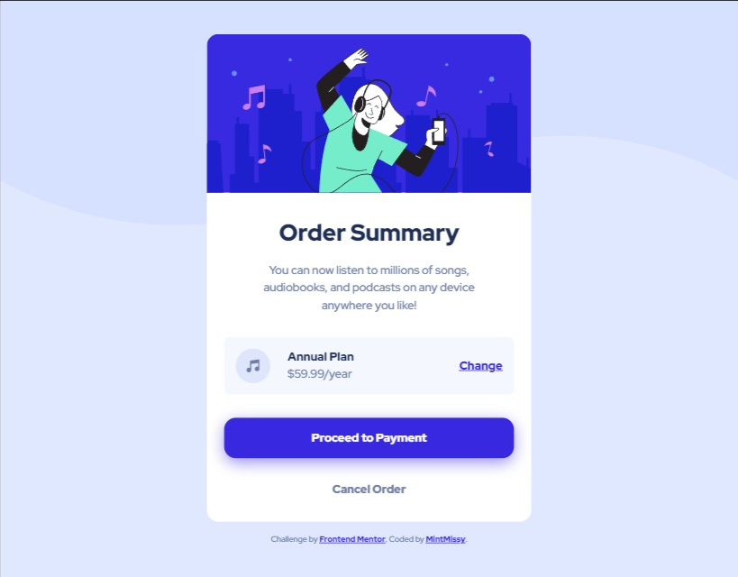

# Frontend Mentor - Order summary card

### Result Screenshot

## The challenge

Your challenge is to build out this order summary card component and get it looking as close to the design as possible.

You can use any tools you like to help you complete the challenge. So if you've got something you'd like to practice, feel free to give it a go.

Your users should be able to:

- See hover states for interactive elements

### Built with

- Semantic HTML5 markup
- CSS custom properties
- Flexbox
- SCSS
